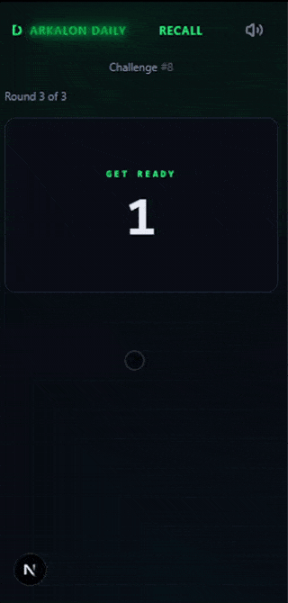
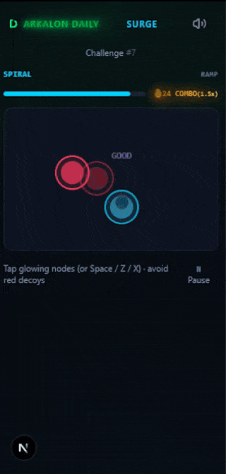
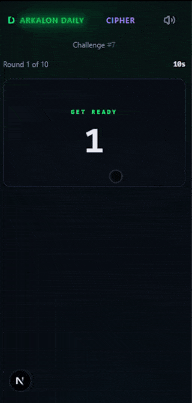
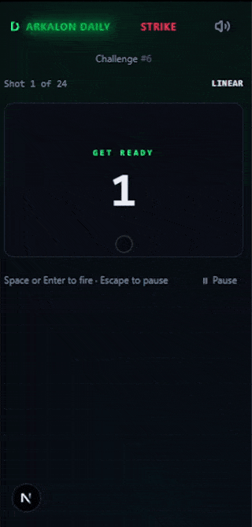
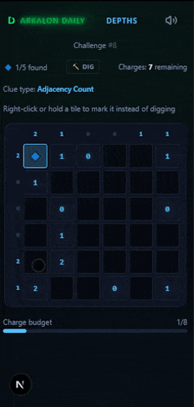

# Arkalon Daily

A browser-based daily puzzle platform offering five optional daily puzzles, each targeting a distinct cognitive skill. Every player who opens a category on the same day receives the identical seeded challenge. One attempt per category per day. Resets at 00:00 UTC. Come back tomorrow.

**Play Here:** [https://daily.rpsleague.fi](https://daily.rpsleague.fi)

> **Development Status:** Arkalon Daily is live in production and fully operational. The platform launched with its complete feature set: five puzzle categories, deterministic challenge generation, server-authoritative scoring, daily/weekly/all-time leaderboards, streaks, identity, share cards, and audio systems all in place. Active development continues with additional puzzle families and deeper Arkalon Network integration on the roadmap.

> **Part of the Arkalon Network:** Arkalon Daily is one application in the wider [Arkalon universe](https://network.rpsleague.fi/), a multi-app ecosystem sharing a common identity layer, visual language, and cross-app recommendation surface. A floating, collapsible network beacon links players directly to the Arkalon AI Oracle, the feedback portal, and other ecosystem titles, broadcasting release and update alerts that automatically clear once explored.

<p align="center">
  <strong>Arkalon Daily Showcase</strong><br/>
  
</p>

---

## Table of Contents

### Puzzles
- [The Five Puzzles](#the-five-puzzles)
- [Deterministic Puzzle Engine](#deterministic-puzzle-engine)
- [Scoring & Streaks](#scoring--streaks)
- [Trials & Onboarding](#trials--onboarding)

### Social & Progression
- [Leaderboards & Yesterday's Review](#leaderboards--yesterdays-review)
- [Profile & Progression](#profile--progression)
- [Share Cards](#share-cards)

### Platform
- [Identity & Recovery](#identity--recovery)
- [Audio & Arkalon Voice](#audio--arkalon-voice)
- [Updates System](#updates-system)
- [Fair Play & Session Integrity](#fair-play--session-integrity)
- [Mobile & PWA Experience](#mobile--pwa-experience)

### Engineering
- [Architecture](#architecture)
- [Design Decisions](#design-decisions)
- [Technical Challenges & Solutions](#technical-challenges--solutions)
- [CI/CD & Infrastructure](#cicd--infrastructure)
- [Tests](#tests)

### Meta
- [Future Improvements](#future-improvements)
- [Changelog](#changelog)
- [Device Compatibility](#device-compatibility)
- [Disclaimer](#disclaimer)
- [Privacy](#privacy)
- [License](#license)

---

## The Five Puzzles

| Category | Core Skill | Primary Archetypes & Modifier Seeds |
|---|---|---|
| **Recall** | Working memory, sequence retention | `standard`, `shuffled`, `reverse`, `nightmare` |
| **Surge** | Rapid reflex to changing stimuli | `spiral`, `wave`, `lane_switch`, `corner_seq`, `triple_burst`, `paired`, `center_out` |
| **Cipher** | Pattern reasoning and rule discovery | `rule_discovery`, `constrained_choice`, `tri_variable`, `dual_variable`, `alternating` |
| **Strike** | Controlled timing accuracy | `deceptive`, `staccato`, `pendulum`, `erratic`, `sinusoidal`, `linear` |
| **Depths** | Spatial deduction and grid logic | **Clues:** `numeric`, `directional`, `hot_cold`, `adjacency_count`<br/>**Topology:** `scattered`, `clustered`, `diagonal_line`, `edges_only`, `center_mass`, `corners`, `l_shape`, `split` |

Each category maps to a registered puzzle family via a one-entry family registry (`FAMILY_REGISTRY`). Adding a new family costs one registry entry plus one component with no other architectural changes required.

---

### Recall
Watch glyph sequences light up across a 16-symbol runic pool (`◆`, `▲`, `●`, `■`, `★`, `◇`, `▼`, `○`, `⬡`, `✦`, `⬢`, `△`, `◈`, `⊕`, `▣`, `✧`), then reproduce them from memory across three escalating rounds. Features procedural sequences with zero adjacent duplicate symbols, a compressed input time bank ($T = \max(14, (6 + 2N) \times 1.125)\text{ seconds}$) with a decaying visual meter, audio urgency ticks on the final 3 seconds, red missed-rune sequence reveals on timeout, symmetrical keypad matrices ($5 \times 2$, $4 \times 4$), and per-round countdown overlays with reverse-entry warnings.

<p align="center">
  <strong>Recall in Action</strong><br/>
  
</p>

#### Unique Seed Archetypes:
* **`standard`**: Keypad layout remains static across all 3 rounds. Glyphs are entered in the exact forward order displayed. Tests baseline working memory retention and span.
* **`shuffled`**: Keypad symbol positions are randomly reshuffled on every round. Prevents muscle memory and spatial motor-pattern shortcuts, forcing conscious visual re-recognition of each runic glyph.
* **`reverse`**: The sequence must be entered in backwards order (from the last glyph seen back to the first). Introduces cognitive interference and working memory manipulation under active timer decay.
* **`nightmare`**: Combines both randomized keypad layout AND backwards sequence entry simultaneously under compressed per-glyph display durations (e.g., Base Config 14: sequence lengths [4, 7, 10], 550ms per-glyph display, 12-glyph active pool). Demands immediate mental sequence inversion while scanning a scrambled keypad matrix.

#### Mechanics & Composition Axes:
* **Sequence Lengths**: 3 to 12 glyphs across 3 rounds (e.g., [3, 5, 7] up to [6, 9, 12]).
* **Per-Glyph Display Duration**: 500ms to 1000ms base (with $\pm 12\%$ continuous variance clamped to a hard playability floor of $\ge 450\text{ms}$).
* **Active Pool Size**: Subsets of 8, 10, 12, 14, or 16 symbols.
* **Scoring Weight**: Weighted continuous model: Round 1 (35%), Round 2 (30%), Round 3 (35%). Speed multiplier scales between $0.85$ and $1.0$:
  $$\text{speedMult} = \max\left(0.85, 1.0 - \frac{\text{elapsedMs} - 1400N}{3200N - 1400N} \times 0.15\right)$$

---

### Surge
A continuous reflex survival arena running for 60 seconds (or 45s / 90s depending on timing profile). Energy nodes spawn, mutate visually, and decay before expiring. Players must tap valid energy nodes while actively avoiding red decoy penalty nodes. Features active mode badge telemetry (`PATTERN // PROFILE`), red decoy evasion nodes across every seed, hybrid mouse-aim with keyboard tapping (`Space`, `Z`, `X`), a live on-screen combo multiplier HUD (`🔥 COMBO` up to 1.5x at 10+ consecutive hits), floating reaction micro-grades (`PERFECT <300ms`, `FAST <450ms`, `GOOD <650ms`, `OK <900ms`, `LATE`, `DECOY -2`), ascending pitch-shifted Web Audio feedback on combo streaks, a 3-2-1 countdown overlay with deferred clock start, an accessible 48px physical touch target floor on mobile, and 32px visual orb clamping.

<p align="center">
  <strong>Surge in Action</strong><br/>
  
</p>

#### Unique Seed Archetypes (Spawn Patterns):
* **`spiral`**: Golden-angle ($137.5^\circ$) inward vortex swirl with orbiting kinetic nodes sweeping toward center.
* **`wave`**: Sinusoidal rolling wave pattern oscillating across the horizontal axis ($y = 200 + 120\sin(\pi x / 300)$).
* **`lane_switch`**: Top, middle, and bottom corridor tracks with visible dashed boundary rails, alternating randomly between lanes.
* **`corner_seq`**: Rapid 4-corner screen-width flick jumps testing peripheral reflex and rapid cross-screen re-acquisition.
* **`triple_burst`**: Clustered 3-node simultaneous spawns with expanded node lifetimes ($1 + 0.35 \times (\text{nodes} - 1)$) to allow multi-target clearing.
* **`paired`**: Symmetrical bilateral mirror spawns requiring rapid dual-target triage.
* **`center_out`**: 4-node radial shockwave exploding outward from center to perimeter.

#### Mechanics & Composition Axes:
* **Decoy Targets**: Red nodes (`#ff3b5c`) that deduct 2.0 raw points and instantly reset current combo to zero if struck. Valid challenges maintain decoy ratios below 40%.
* **Target Behaviors**: `stationary`, `fading` (opacity decays with age), `shrinking` (radius reduces up to 50%), `growing` (radius expands over time), `moving` (linear drift $+35\text{px} \times \text{progress}$), and `brief` (quick fade-in and fade-out).
* **Timing Profiles**:
  * `ramp`: Linear spawn interval acceleration from 520ms down to 240ms over 60s.
  * `sudden_spike`: 420ms pacing jumping abruptly to 220ms at $t = 36\text{s}$.
  * `wave`: Sinusoidal tempo oscillation between 220ms and 500ms on a 15-second cycle.
  * `pressure`: Sustained rapid 260ms spawn interval.
  * `endurance`: Steady 320ms tempo across 60 seconds.
  * `mixed`: 15-second intervals cycling unpredictably between 250ms, 340ms, and 440ms.
  * `slow_short`: 420ms spawn tempo over a condensed 45-second session.
  * `fast_long`: 320ms spawn tempo over an extended 90-second marathon.
* **Combo Multiplier**: $\text{multiplier} = 1.0 + \min(\text{consecutiveHits} \times 0.05, 0.5)$ (max 1.5x at 10+ consecutive hits).

---

### Cipher
Deduce transformation rules and structural logic across 7 to 12 escalating rounds. Features single-attempt-per-round resolution with instant answer reveals on errors (eliminating brute-force guessing), dynamic inductive rule generation, 4 to 6 choices per round, and countdown timer deadlines (8s, 9s, 10s, or 12s untimed fallback) with audio urgency ticks on the final 3 seconds.

<p align="center">
  <strong>Cipher in Action</strong><br/>
  
</p>

#### Unique Seed Archetypes (Pattern Generators):
* **`rule_discovery`**: Inductive logic. Presents 3 positive (YES) and 2 negative (NO) examples. Players must deduce the unstated underlying rule governing membership. Rules procedurally select from:
  * `specific_color`: All YES items share a mandatory color (e.g., all blue).
  * `specific_shape`: All YES items share a mandatory shape (e.g., all hexagons).
  * `specific_size`: All YES items share a mandatory scale (e.g., all small).
  * `color_family`: Temperature classification: Warm (Red, Orange, Yellow) vs Cool (Blue, Green, Purple).
  * *Constraint*: The correct choice is a novel valid element not seen in the YES box; distractors are novel invalid elements not shown in the NO box.
* **`constrained_choice`**: Multi-criteria elimination under timer pressure. Presents 3 to 4 simultaneous positive and negative constraints drawn from 6 rule classes:
  1. *Affirmation*: "Must be [color/shape/size]"
  2. *Exclusion*: "Cannot be [color/shape/size]"
  3. *Tone*: "Must be warm-toned" or "Must be cool-toned"
  4. *XOR Combination*: "Must be [color] or [shape], but not both"
  5. *Trait Intersection*: "Shares exactly one trait with the [target]" or "Shares no traits with the [target]"
  6. *Conditional Implication*: "If it is [color], it must be [size]"
  * *Distractor Design*: Distractors are crafted near-misses that satisfy all constraints except exactly one.
* **`tri_variable`**: 3-axis independent cycle deduction. Shape, color, and size rotate on independent, out-of-sync prime periods (shape period 3–5, color period 2–3, size period 2–3). Demands isolating each attribute cycle independently.
* **`dual_variable`**: 2-axis matrix cycle deduction (shape period 3 cycling against color period 2, with size held constant).
* **`alternating`**: Binary alternating sequence logic ($A \rightarrow B \rightarrow A \rightarrow B$).

#### Mechanics & Composition Axes:
* **Element Attributes**: 6 Shapes (`circle`, `square`, `triangle`, `diamond`, `hexagon`, `star`), 6 Colors (`red`, `blue`, `green`, `yellow`, `purple`, `orange`), 3 Sizes (`small`, `medium`, `large`).
* **Scoring Formula**:
  $$\text{Score} = \left(\frac{\text{correctRounds}}{\text{totalRounds}} \times 80\right) + \left(20 \times \max\left(0, 1.0 - \frac{\text{totalIncorrectGuesses}}{\text{totalRounds}}\right)\right)$$

---

### Strike
Fire when a moving reticle crosses the target window on a 600-unit logical track. Enforces a 30% runway constraint ($x \ge 180\text{px}$) so targets never spawn in front of the starting reticle, ensuring immediate first-pass shot opportunities. Features shot 1 countdown overlays, color-coded motion badges, an 800ms grade reveal on the final shot before transition, and debounced ref-based firing via Space, Enter, or the on-screen FIRE button.

<p align="center">
  <strong>Strike in Action</strong><br/>
  
</p>

#### Unique Seed Archetypes (Kinematics Motion Functions):
* **`deceptive`**: Multi-phase feint kinematics. The reticle approaches linearly up to 100px before the target, decelerates to 30% speed for 300ms, reverses backwards at -25% velocity for 200ms, and then accelerates forward through the target at $1.2\times$ velocity.
* **`staccato`**: Stepper-motor tracking. Advances in rapid 250ms bursts punctuated by 150ms dead-stops, requiring players to predict whether the reticle will pause inside or skip over the target window.
* **`pendulum`**: Harmonic gravity release ($x(t) = 300 - 260\cos(\omega t)$). Starts at rest from the left apex ($x = 40\text{px}, v = 0$), sweeping at peak kinetic velocity through center and decelerating at the edges.
* **`erratic`**: High-frequency dual-sine vibration wave ($x_{\text{linear}} + 10\sin(7.3t) + 6\sin(13.1t)$) producing jittery, unpredictable reticle flutter.
* **`sinusoidal`**: Smooth harmonic wave oscillation across the track width ($300 + 250\sin(2\pi f t \cdot v)$ with seeded frequency $f \in [0.3, 0.8]\text{Hz}$).
* **`linear`**: High-velocity constant-speed passes ($1.8\times – 2.3\times$) bouncing off track edges.

#### Mechanics & Composition Axes:
* **Shot Counts**: 15 to 30 shots per session.
* **Target Windows**: 32px to 60px target zones.
* **Reticle Speeds**: $1.4\times$ to $2.3\times$ multipliers ($280\text{px/s}$ to $460\text{px/s}$).
* **Deviation Grades**:
  * `PERFECT` ($< 5\text{px}$ deviation): $1.0\times$ value
  * `EXCELLENT` ($< 15\text{px}$ deviation): $0.8\times$ value
  * `GOOD` ($< 50\%$ target window): $0.55\times$ value
  * `EARLY / LATE` ($< 100\%$ target window): $0.25\times$ value
  * `MISS` ($\ge$ target window): $0.0\times$ value
* **Scoring Formula**:
  $$\text{Score} = \sum_{i=1}^{\text{shots}} \left(\text{grade}_i \times \frac{100}{\text{shots}}\right)$$

---

### Depths
A pure, untimed spatial deduction puzzle built on the Seismic Matrix system. Features outer row and column crystal counters (nonogram style) paired with inner proximity clues, allowing 100% deterministic, zero-guess solutions. Excavating empty tiles pings Active Sonar distance data directly from the excavated cell to turn misses into new triangulation points. Includes tile elimination crosses (`✖`) to mark suspected empty tiles via Right-Click, 450ms long press, or the Dig/Cross toggle button. When charges deplete with crystals still buried, the excavation ends and an auto-scan sequence reveals all remaining hidden crystals in dashed grayscale with staggered animations so the player sees the full solution without altering their final score.

<p align="center">
  <strong>Depths in Action</strong><br/>
  
</p>

#### Unique Seed Archetypes (Sensor Clue Types):
* **`numeric`**: Manhattan distance rings ($|r_1 - r_2| + |c_1 - c_2|$) indicating the exact distance to the nearest crystal.
* **`directional`**: 8-way compass vector arrows (`→`, `↘`, `↓`, `↙`, `←`, `↖`, `↑`, `↗`) pointing directly toward the nearest crystal.
* **`hot_cold`**: Thermal radar bands based on Manhattan distance: `HOT` ($\le 1$), `WARM` ($\le 3$), `COLD` ($> 3$).
* **`adjacency_count`**: Moore neighborhood 8-cell surrounding mine counts (0 to 8).

#### Deposit Topology Templates:
* **`scattered`**: Uniform random distribution across the matrix.
* **`clustered`**: Tightly packed formation around a single focal point.
* **`diagonal_line`**: Formations aligned along primary diagonals.
* **`edges_only`**: Crystals confined strictly to the outer perimeter border tiles.
* **`center_mass`**: Formations confined strictly within the central radius.
* **`corners`**: Formations partitioned among the four $2 \times 2$ corner zones.
* **`l_shape`**: Orthogonal intersecting arms forming an L-shaped vein.
* **`split`**: Bisected field splitting deposits evenly between left and right halves.

#### Mechanics & Composition Axes:
* **Grid Sizes**: 5×5 (Base Config 0 & Trials), 6×6, and 7×7 matrices.
* **Active Sonar Principle**: Digging an empty tile triggers a sonar ping that **always reveals the numeric Manhattan distance** from that specific tile to the nearest deposit, providing instant triangulation data regardless of the board's baseline clue type.
* **Charge Limit Formula**:
  $$\text{Charge Limit} = \text{depositCount} + \text{cluePenalty}[\text{clueType}] + \lfloor\text{gridSize}^2 \times 0.08\rfloor$$
  *(where penalties are: numeric = 0, directional = 2, adjacency_count = 1, hot_cold = 3)*
* **Scoring Formula**:
  $$\text{Score} = \left(\frac{\text{depositsFound}}{\text{totalDeposits}} \times 80\right) + \left(20 \times \max\left(0, 1.0 - \frac{\text{wastedCharges}}{\text{maxWaste}}\right)\right)$$
  *(where $\text{wastedCharges} = \text{chargesUsed} - \text{depositsFound}$ and $\text{maxWaste} = \text{chargeLimit} - \text{totalDeposits}$)*

---

## Deterministic Puzzle Engine

The core engineering challenge: identical challenges for every player, fairly, without any server-side game tick.

- **Daily seeds** derive from `HMAC-SHA256(secret, "YYYY-MM-DD:category")` and are consumed server-side by `mulberry32`, a 32-bit seeded PRNG. The raw seed never reaches the client.
- **Base configurations**: each category ships 15 hand-crafted base configurations. Continuous-parameter variation (timing $\pm 12\%$, windows $\pm 10\%$, speed $\pm 8\%$) produces 200+ meaningfully distinct daily instances per category.
- **Validation and retry**: every generated challenge passes a per-family validator before acceptance. Rejections re-seed with a deterministic counter prefix (`attempt.toString(16) + baseSeed.slice(2)`), so the accepted instance is identical for all players regardless of how many attempts were needed.
- **Seed persistence**: a VPS crontab at 00:00 UTC hits a secret-protected route (`/api/cron/generate-daily`) to persist the day's `daily_puzzles` rows before the first player arrives.

Validator highlights per family:
- **Recall**: Enforces a 450ms per-glyph display floor, pool containment, and zero consecutive duplicate symbols.
- **Surge**: Rejects decoy ratios exceeding 40% and combinations of pressure timing with splitting behavior.
- **Strike**: Rejects deceptive motion at $2.5\times+$ speed with target windows narrower than 25px.
- **Cipher**: Rejects duplicate choices, choices missing the correct answer, and monotone single-generator sessions.
- **Depths**: Runs a full clue-elimination solvability proof, verifying that the grid can be deduced within the charge limit, and rejects degenerate hot/cold layouts.

---

## Scoring & Streaks

All scoring is server-authoritative. Clients submit raw performance metrics; the server recomputes `normalized_score` (0–100) from scratch. No client score is trusted.

| Puzzle | Model | Formula Summary |
|---|---|---|
| **Recall** | Continuous | Sum of round weights [35, 30, 35] $\times$ accuracy $\times$ speed multiplier (0.85–1.0) |
| **Surge** | Speed-first | $\sum (100 / \text{expectedNodes}) \times \text{reactionGrade} \times \text{comboMultiplier} - (2.0 \times \text{decoyHits})$ |
| **Strike** | Speed-first | $\sum (100 / \text{shots}) \times \text{deviationGrade}$ (1.0 / 0.8 / 0.55 / 0.25 / 0.0) |
| **Cipher** | Logic-first | $(\text{accuracy} \times 80) + (20 \times \text{errorEfficiencyBonus})$ |
| **Depths** | Logic-first | $(\text{discovery} \times 80) + (20 \times \text{chargeEfficiencyBonus})$ |

Scores map to a 12-tier visual shader hierarchy (from Slate Steel up to Solar Prominence and Royal Treasure Pile) and 5 rarity tiers (Common through Mythical/Rainbow). A score of 15 or higher (`STREAK_MIN_SCORE`) counts as a solve and preserves a streak; lower scores or missing days break it.

**Streaks** recompute by walking consecutive UTC dates backward from the latest result. This makes streaks immune to missed writes and incrementing bugs. Milestones at 7, 30, 100, and 365 days fire rarity-tiered overlay animations (Rare, Legendary, Mythical, Rainbow) with dedicated sound stings and spoken Arkalon proclamations, celebrated once per category per milestone.

---

## Trials & Onboarding

First contact with each category opens a Trial: a multi-screen explainer followed by a seeded practice run on fixed trial seeds with constrained axes (no deceptive motion, no reverse entry, numeric clues only, guaranteed decoys where the explainer teaches them) introduce each mechanic without difficulty spikes. A persistent amber banner makes clear the run never counts toward a streak or leaderboard. Completing the trial unlocks the real daily attempt; skipping is always allowed. New visitors meet the Welcome Modal (identity card, nickname reroll, five-puzzle showcase) instead of going straight to a trial.

---

## Leaderboards & Yesterday's Review

- **Daily Boards**: Top 50 per category ordered by score descending, then elapsed time ascending. Exact rank is computed for players outside the top 50. A daily family index displays alongside each entry.
- **Weekly & All-Time Tiers**: Fully operational aggregate rankings with instant qualification:
  * *Universal Qualification*: Clearing **1 puzzle** ($\text{score} \ge 15$) instantly ranks players across Daily, Weekly, and All-Time boards.
  * *Category Boards*: Ordered primarily by Average Score (`AVG`), with clears and best score acting as tiebreakers.
  * *TOTAL Scope*: The cross-category leaderboard orders primarily by **Total Points (`PTS`)**, rewarding players who show up daily and compete across all five disciplines. Surfacing per-category clear pips for each player row.
  * *Metrics Displayed*: Average score, clears count, best score, total points, and active streak days.

---

## Profile & Progression

Each profile surfaces deterministic visual identity and per-category performance data:

- **Deterministic Avatar**: FNV-hash gradient hues derived from the player's core UUID with nickname initials overlaid, producing a unique visual identity without stored image assets.
- **Identity Card**: Badge chips showing total puzzles played, active streaks per category, trial completion progress, and one-click public profile link copying.
- **Shareable Public Profiles**: Server-rendered public dossiers at `/profile/[id]` linked directly from leaderboard rows, withholding private recovery credentials.
- **Skill Profile**: A normalized bar chart of per-category score averages, shown once the player has 3+ plays in a category.
- **Per-Category Stats Panel**: Today's attempt result (score and pass/fail status), best score, average score, days played, current streak, longest streak, and global percentile (suppressed below a 25-player population).

---

## Share Cards

Result cards render entirely client-side: `html2canvas` captures an offscreen 540x675 card at 2x scale into a PNG, handed to the Web Share API with file attachment. Desktop falls back to image download plus clipboard text; any further failure falls back to text-only share. Animations and background images are stripped in the cloned document and hard timeouts guard both render and blob stages. Each category communicates its attempt through a unique performance strip:

| Category | Performance Strip Representation |
|---|---|
| **Recall** | Per-round glyph accuracy grid (green correct / red error cells) |
| **Surge** | Color-graded reaction-time bar chart across 32 nodes, misses flattened to zero |
| **Cipher** | Per-round check (`✓`) or cross (`✗`) sequence with round labels (`R1`, `R2`...) |
| **Strike** | Shot grade letters (`P`, `E`, `G`, `L`, `◇`) color-coded by accuracy |
| **Depths** | Mini excavation grid illustrating discovered crystal locations |

Score numbers render in solid tier-matched colors rather than gradient fills, working around an `html2canvas` limitation with `background-clip: text`.

---

## Identity & Recovery

No accounts, no email, no passwords. Identity is provisioned by the Arkalon Network hub as an anonymous core UUID shared across the ecosystem via root cookies. Nicknames are procedurally generated and rerollable at any time.

The hub's human-readable recovery code is the only cross-device restoration mechanism. A one-time Recovery Tutorial overlay (server-persisted so it fires exactly once) teaches players to save their code before their first streak is at risk.

---

## Audio & Arkalon Voice

Three independent channels, each with its own toggle and volume control, persisted in localStorage:

- **Sound FX**: HTML5 audio pools (3-deep per effect) cover standard sounds. Rapid-tap effects during Surge and Depths run through a Web Audio polyphony engine (6 simultaneous voices with voice stealing) to handle burst tap rates without audio dropouts.
- **Background Music**: Context-aware BGM rotates three menu tracks and loops one genre-distinct track per category (IDM for Cipher, dub-techno for Depths, memory piano for Recall, percussion for Strike, DnB for Surge), crossfaded over 1 second.
- **Arkalon Voice**: Browser-native Web Speech API at pitch 0.25 and rate 0.75, with synthetic cadence pauses inserted between words and punctuation boundaries. Delivers the daily welcome, category entries, result verdicts, and milestone proclamations at zero server cost. Voice primed on application mount with refresh-on-speak logic for asynchronous browser voice loading. A cooldown prevents collisions with simultaneous sound effects.

---

## Updates System

A single `UPDATES` array in `src/lib/updates.ts` is the source of truth for all release history. Returning players whose acknowledged version stamp lags behind the latest receive the Update Modal on load; new players get the Welcome Modal instead. The `/updates` page renders the full history as a sortable accordion (newest or oldest first) with the latest entry highlighted.

---

## Fair Play & Session Integrity

- **One attempt per player/date/category**, enforced by a database unique constraint. Duplicate submissions reject cleanly with a clear error.
- **Tab Guard**: BroadcastChannel detects duplicate tabs and pauses active gameplay; real-time puzzles (Surge, Strike) also pause on tab hide and on Escape.
- **Pause Overlay**: Blurs the play surface so no state can be studied while paused. Resumes through a 3-2-1 countdown; paused milliseconds are excluded from all timing metrics.
- **Submission Rate Limiting**: 5 submissions per minute per player, with periodic stale-entry cleanup.
- **Mid-Session Persistence**: Turn-based puzzles (Recall, Cipher, Depths) resume exact round and grid progress in localStorage to prevent reset exploits, while real-time puzzles (Surge, Strike) track against wall-clock time so refreshing cannot be used to restart timers or dodge shots.

---

## Mobile & PWA Experience

- **Progressive Web App**: Installable directly from modern browsers on mobile (iOS Safari via Add to Home Screen, Android Chrome via Install prompt) and desktop (Chrome, Edge, Brave) to launch in a standalone, borderless window with custom icons.
- **Ultra-Compact Viewport Resilience (320px)**: The mobile layout scales down to 320px viewports with zero horizontal overflow, dynamic text scaling on category titles, touch-padded hitboxes, and an integrated bottom telemetry bar. Includes an adaptive, high-density leaderboard that surfaces inline sub-row telemetry on mobile with zero nickname truncation, expanding cleanly into dedicated multi-column table layouts on wider viewports.
- **Adaptive Wide-Screen Layout**: Scales from tablet through desktop to ultra-wide (1152px+), transforming into a 50/50 split pairing the interactive puzzle rack with a Mission Control telemetry suite showing the live UTC countdown clock, daily clearance pips, and discipline breakdown.
- **Input Parity**: Touch and keyboard controls are first-class citizens (Space/Enter to fire or select, Space/Z/X hover-tapping for Surge, Escape to pause, focusable glyph keypad buttons).

---

## Architecture

| Layer | Choice |
|---|---|
| Framework | Next.js 16 App Router (Server Actions) |
| Styling | Tailwind CSS v4 (CSS-first, Arkalon tier shaders) |
| Client Platform | Progressive Web App (standalone manifest) |
| State | Zustand 5 (`puzzleStore`, `uiStore`, `musicStore`) |
| Database | PostgreSQL 17 via `pg.Pool` |
| Seed Generation | HMAC-SHA256 + mulberry32 seeded PRNG |
| Input Validation | Zod schemas on all Server Action inputs |
| Share Cards | html2canvas + Web Share API |
| Deployment | Docker on Hetzner VPS, Caddy reverse proxy |

```text
+-----------------------+                    +-------------------------------+
|  VPS Crontab 00:00    | -- CRON_SECRET --> |   /api/cron/generate-daily/   |
+-----------------------+                    +-------------------------------+
                                                             |
+-----------------------+                    +-------------------------------+
| Player Browser (User) | -- UI / Zustand -> |  Next.js Frontend (App Router)|
+-----------------------+                    +-------------------------------+
                                                             |
                                            +----------------+----------------+
                                            |                                 |
                                            v                                 v
                             +-----------------------------+   +-----------------------------+
                             | Server Actions              |   | Arkalon Network Hub         |
                             | (Seed Gen / Score / Streak) |   | (Identity / Shared Root)    |
                             +-----------------------------+   +-----------------------------+
                                            |
                                            v
                             +-----------------------------+
                             | PostgreSQL (arkalon_daily)  |
                             +-----------------------------+
```

---

## Design Decisions

- **Zero-friction identity**: Anonymous ecosystem-wide core ID over local accounts; recovery code over passwords. Players are in the puzzle loop within seconds of first visit.
- **Server-authoritative everything**: Seeds, scores, streaks, and ranks never trust the client. Raw metrics are submitted; the server recomputes the score entirely.
- **Determinism over ticks**: HMAC + seeded PRNG replaces a live challenge generator, delivering fairness without sustained server load. Every player's challenge is identical.
- **Optional by design**: Five optional puzzles framed as daily extensions, never obligations. Continuation panels invite rather than guilt; missing a day breaks a streak without punitive locks.
- **Pause over penalty**: Interruptions pause real-time puzzles instead of penalizing them. The pause overlay blurs state so pausing cannot be exploited to study solutions.
- **Client-side spectacle at zero server cost**: Share cards, Arkalon Voice TTS, and result animations render locally at zero server expense.
- **One-entry family registry**: Adding a new puzzle family to any category costs one registry line and one component, making the system composable without structural changes.

---

## Technical Challenges & Solutions

**Deterministic validation retries**
Rejected seeds re-derive with counter prefixes (`attempt.toString(16) + baseSeed.slice(2)`) so every player independently converges on the same accepted challenge. Up to 20 retry attempts are made before a hard error is thrown.

**High-frequency tap audio under Surge tap rates**
Standard HTML5 audio pools clip under burst tap rates during Surge. Solved by decoding audio buffers into Web Audio API nodes with 6-voice polyphony and voice stealing, maintaining clean sound at maximum tap speed.

**html2canvas stability for share cards**
Animations, background gradients, and `background-clip: text` fills break in the html2canvas cloned document. The clone strips these before capture and hard timeouts guard both render and blob conversion stages, preventing hung share attempts on slow devices.

**Frame-perfect real-time rendering without React re-renders**
Strike's reticle and Surge's node positions are driven directly from a `requestAnimationFrame` loop through DOM refs, keeping React entirely out of the 60fps render path. State changes that need React (score updates, completion) are batched and applied on round completion rather than per frame.

**Streak truthfulness**
Streaks recompute from the full result history by walking consecutive UTC dates backward on every submission, rather than trusting incremental updates. This makes streaks immune to missed writes, race conditions, and clock drift.

**Depths solvability proof**
A grid-constraint elimination pass runs server-side before any Depths challenge is accepted. It applies every clue's elimination rules, counts remaining possible tiles, and rejects any challenge where deposits cannot be deduced within the charge budget.

---

## CI/CD & Infrastructure

CI gates every push with a TypeScript type check and full production build (using dummy build-time environment variables). Deploys SCP source to the VPS, rebuild the Docker image tagged with the commit SHA, recreate the container, and verify via an automated health probe. The app runs as a single Docker container behind shared Caddy on a Hetzner VPS.

| Stage | Tool | Purpose |
|---|---|---|
| Testing | TypeScript + Next.js Production Build | Type checking and production build verification |
| Deployment | GitHub Actions to Hetzner VPS | CI gate, SCP sync, Docker rebuild, health probe |
| Infrastructure | Docker, Caddy, PostgreSQL 17 | Single container, automatic TLS, private db-net |
| Seed Generation | VPS crontab at 00:00 UTC | Secret-protected route persists daily_puzzles rows |
| Backups | pg_dump + Backblaze B2 rotation | Daily ecosystem-wide database backup |

### Key Workflows

- `ci.yml` runs type check and production build on all pushes and pull requests.
- `deploy.yml` deploys to the Hetzner VPS after CI passes, rebuilds Docker with the commit SHA as the image tag, recreates the container, and verifies health via `node -e fetch(...)`.

PostgreSQL lives in a shared container on a private `db-net` with no public port, owns its isolated `arkalon_daily` database, and is covered by the ecosystem's daily `pg_dump` plus Backblaze B2 backup rotation.

---

## Tests

Comprehensive Vitest coverage across the deterministic puzzle engine, server-authoritative scoring and validation, leaderboard math, and client session flow.

> 👉 [View full Test Suite Documentation →](./tests.md)

---

## Future Improvements

- **New Puzzles**: Additional puzzle families and new categories.
- **New Varieties to Existing Puzzles**: More mechanics, modifiers, and layout variations for current games.
- **Bigger Seed Pool for Puzzles**: Expanding beyond the 15 base configurations per category.
- **Social & Rivalry Systems**: "Compare with You" ghost skill profile overlays, pinned rivals on leaderboards, and direct challenge links.
- **Deeper Arkalon Network Integration**: Milestone trophy case (rendering celebrated streak badges), shared ecosystem achievements, and cross-app profile linking across all Arkalon titles.

---

## Changelog

All notable updates to Arkalon Daily are documented in the project changelog and surfaced in-app through the Update Modal and the `/updates` page.

> 👉 [View full changelog →](./CHANGELOG.md)

---

## Device Compatibility

- **Progressive Web App (PWA)**: Installable on iOS 14+ (Safari, Add to Home Screen), Android 9+ (Chrome, Install prompt), and desktop (Chrome, Edge, Brave).
- **Supported Browsers**: Chrome, Firefox, Safari, Edge (modern versions). Graceful audio degradation on browsers with restricted AudioContext autoplay or speech synthesis policies.
- **Minimum Viewport**: 320px with full layout integrity, zero horizontal overflow, and touch-padded hitboxes.
- **Not Supported**: Internet Explorer and legacy browsers lacking Web Audio API or modern CSS flexbox/grid support.

---

## Disclaimer

Arkalon Daily is a skill-tracking game experience. Scores, streaks, and rankings are purely recreational and hold no monetary value. Challenges reset daily at 00:00 UTC; missed days cannot be replayed.

---

## Privacy

No emails, passwords, or personally identifiable information are collected or stored. Identity is an anonymous ecosystem UUID provisioned by the Arkalon Network hub. Sound preferences and version acknowledgements live only in browser localStorage. Server logs never contain personally identifiable information.

---

## License

Copyright (c) 2026 Alex Degerman. All Rights Reserved.

Arkalon Daily and all associated source code, assets, systems, and files are proprietary. Unauthorized copying, modification, distribution, public hosting, sublicensing, or use of this software, in whole or in part, is strictly prohibited without prior written permission from the copyright holder.

---

*Part of the [Arkalon Network](https://network.rpsleague.fi)*